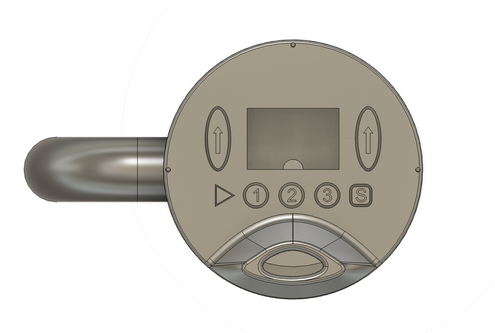
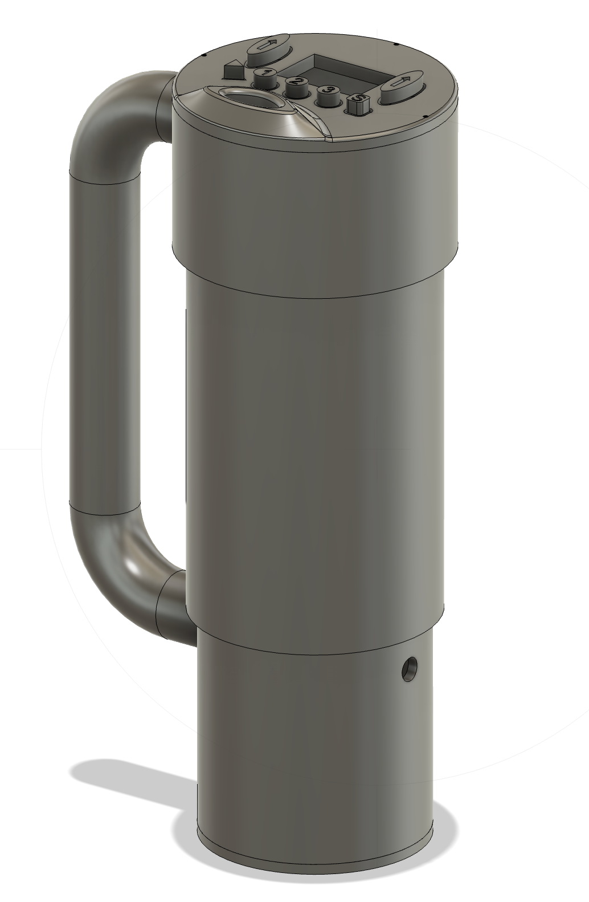
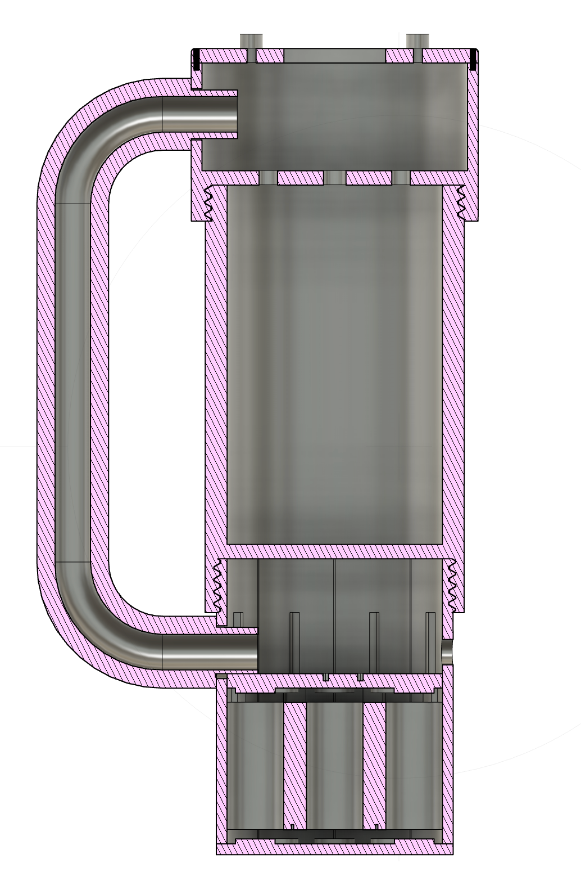

# Smart Mug: ICUP
### Intelligent Cup for Unprecedented Pleasure... just kidding, it's a smart mug.

A self-regulating smart mug that heats your beverage to a precise user-set temperature 
and holds it there — built from scratch by a team of 7 SFU engineers.

---

## The Problem
Beverages are either too hot, too cold, or lose their temperature too quickly. 
Getting the right temperature is tedious, and keeping it there is worse.

## The Solution
ICUP is a battery-powered smart mug with an embedded heating element, real-time 
thermocouple sensing, and an OLED display UI — all housed in a custom 3D-printed 
enclosure designed in Fusion 360.

---

## Demo

https://github.com/user-attachments/assets/https://youtu.be/zo6oe5yAwa8

---

## CAD Design

| Exterior | Top View | Cross Section |
|----------|----------|---------------|
|  |  |  |

The enclosure was modeled in Fusion 360 and designed to house:
- Arduino Pro Mini + wiring in a dedicated internal chamber
- 12x Li-ion 18350 cells in a custom bottom battery pack (low center of gravity)
- A 12V 50W heating rod in a thermally isolated inner section
- OLED display and waterproof membrane buttons on the lid

Materials: PLA body, ABS lid (heat resistant), Nylon filament (-70°C to 250°C rated)

---

## How It Works

### Heating
Using Q = mcΔt, we calculated that heating 500mL of water from 25°C to 60°C 
in under 15 minutes requires ~81.5W. A 12V 50W heating rod controlled via MOSFET 
drives the element, switched on/off based on thermocouple feedback.

### Temperature Control
An Arduino Pro Mini reads the fluid temperature via a MAX6675 thermocouple every 
100ms. When the current temperature is below the target, the heating element 
activates. Once the target is reached, it cuts off — simple bang-bang control.

### UI
- OLED display shows current temp, desired temp, and heating status
- Up/Down buttons to adjust target temperature 1°C at a time
- Preset buttons for quick jumps to saved temperatures
- Battery monitoring via analog voltage read

### Power Supply
Custom 6S Li-ion pack built from 12x 18350 cells (22.2V nominal, 30Wh+), 
managed by a 6S BMS. Housed in the bottom of the mug for stability.

---

## Hardware Bill of Materials

| Component | Cost |
|-----------|------|
| 12V 50W Heating Rod | $36.49 |
| MOSFET 30A 60V (x10) | $11.99 |
| Arduino Pro Mini (x3) | $23.99 |
| 5V Regulator (x5) | $12.55 |
| 6S 22V Li-ion BMS | $8.99 |
| Thermocouple Sensor | $10.80 |
| 18350 Li-ion Batteries (x12) | $60–$80 |
| **Total** | **~$165–$185** |

---

## Team
Built by Group Digamma — SFU Engineering, LA 25

Bhavan Thandi · Kalib · Yael · Taiyo · Ajay · Harjas · Amar
